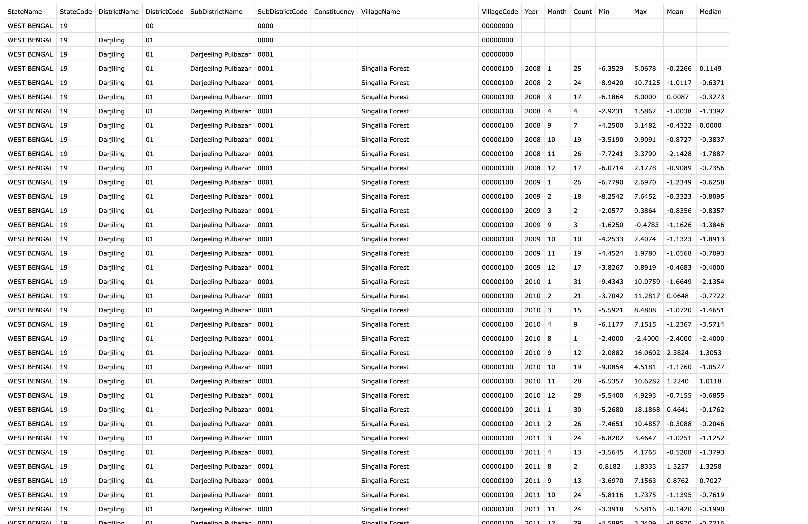

# indialights-fetch
This is a python code to get bulk village level lights data using India Lights API - http://api.nightlights.io/

## Usage
`VillagesForState.py` is the python file with the bulk fetch logic. Run this python file to start fetching and storing data in a `csv` file.
Paramaters at the top of the file can be changed accordingly to fetch the required bulk data.
Comments are added for explanation of parameters.

`village_dumps_by_state` folder has the respective village code dumps for each state.
The program automatically picks up the correct village code dump based on the state provided.
Village code dumps are information about all the villages in a state according to India's 2001 census.
The village codes required by India Lights API are 16 digit codes for villages from India's 2001 census data,
as can be seen in the first 4 columns in [West Bengal's list of villages from the census](http://censusindia.gov.in/Census_Data_2001/PLCN/DIR-19r.pdf).
Data for other states can be found [here](http://censusindia.gov.in/Census_Data_2001/PLCN/plcn.html).

#### Setting up for a new state
If data is to be fetched for states other than Assam, Andhra Pradesh, Bihar, Uttar Pradesh, Orissa or West Bengal, the following steps have to be followed.

###### Adding village dump:
Village dumps for the above mentioned 6 states have been added.
The program traverses the corresponding file line by line to get a village code, and subsequently hit the India Lights API with each village code.
To add a dump file for any other state, follow these steps. It should take 5 minutes.
You should get a file formatted like `village_dumps_by_state/wb_villages_dump.csv` by the end of these steps.

Steps to create village dump file:
1. Download census 2001 data for respective state from [here](http://censusindia.gov.in/Census_Data_2001/PLCN/plcn.html).
2. Open in preferred PDF reader and copy all contents (this may take a few seconds) to a text editor which supports regex, like [Sublime Text](https://www.sublimetext.com/).
3. Enter Find mode (Ctrl+F on Windows or Cmd+F on Mac).
4. Enter `^[0-9]{2} [0-9]{2} [0-9]{4} [0-9]{8} .*`. This is the regex to search for all relevant entries in the file.
5. Click Find All.
6. Copy the content. Paste it in a new file and save it inside `village_dumps_by_state` folder.

###### Further steps:
1. In `state_meta_files` folder, add a python file for your state, copy the content from any of the other state meta files and modify
the fields according to use. The explanation for the fields are given in `StateMetaFile.py` file.
2. In `utils` folder, add an entry for your state in `State.py`. 
3. In the same folder, modify `get_meta_data_for_state.py` by adding a field for your state as done for the other states.
4. Now all you need to do is change the `state` parameter in `VillagesForState.py` file.

## Sample data

